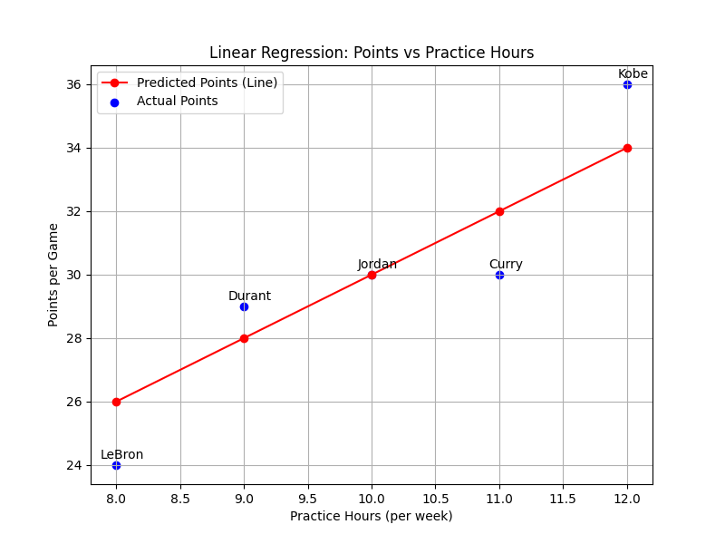

# 📈 Linear Regression: Predicting Basketball Player's Points

This page explains how linear regression works using a sports example: predicting a basketball player's points per game based on their practice hours per week.

---

## 📊 Example Data

Consider the following data for 5 players:

| Player  | Practice Hours (per week) | Actual Points (per game) | Predicted Points (per game) |
|---------|---------------------------|--------------------------|-----------------------------|
| Jordan  | 10                        | 30                       | 30                          |
| Kobe    | 12                        | 36                       | 34                          |
| LeBron  | 8                         | 24                       | 26                          |
| Durant  | 9                         | 29                       | 28                          |
| Curry   | 11                        | 30                       | 32                          |

---

## 🔢 Linear Regression Formula

Linear regression finds the best-fitting straight line through your data points. The equation of this line is generally written as:

\[
y = mx + b
\]

where:  
- **\( m \)** is the **slope**, representing how many additional points are expected for every extra hour of practice, and  
- **\( b \)** is the **intercept**, representing the baseline points when practice hours are zero.

For our model, we have determined:  
- **Slope (\( m \))** = 2.0  
- **Intercept (\( b \))** = 10  

Thus, our specific linear equation becomes:

\[
y = 2.0x + 10
\]

where:  
- \(y\) represents the predicted points per game, and  
- \(x\) represents the practice hours per week.

---

## 🏀 Scenario and Visual Illustration

Imagine you're a basketball coach, and you want to predict how many points a player will score in a game based solely on their average practice hours per week. For instance, for **Jordan**:
- Using our model: Predicted Points = 2.0 × 10 + 10 = 30  
- Notice that Jordan's actual points match the prediction exactly, while the other players' actual points deviate from the predicted values.

Below is an image illustrating this concept:

---

## 🌟 Key Takeaways

- **Interpretability**: Linear regression is simple and interpretable—the slope tells you how many additional points are expected for every extra hour of practice.
- **Simplicity**: It assumes a linear relationship between the feature (practice hours) and the target (points scored).
- **Limitations**: Real-life performance might be influenced by other factors like game conditions, opponents, and teamwork, which may not be captured in a simple linear model.

Happy predicting and keep practicing! 🚀
